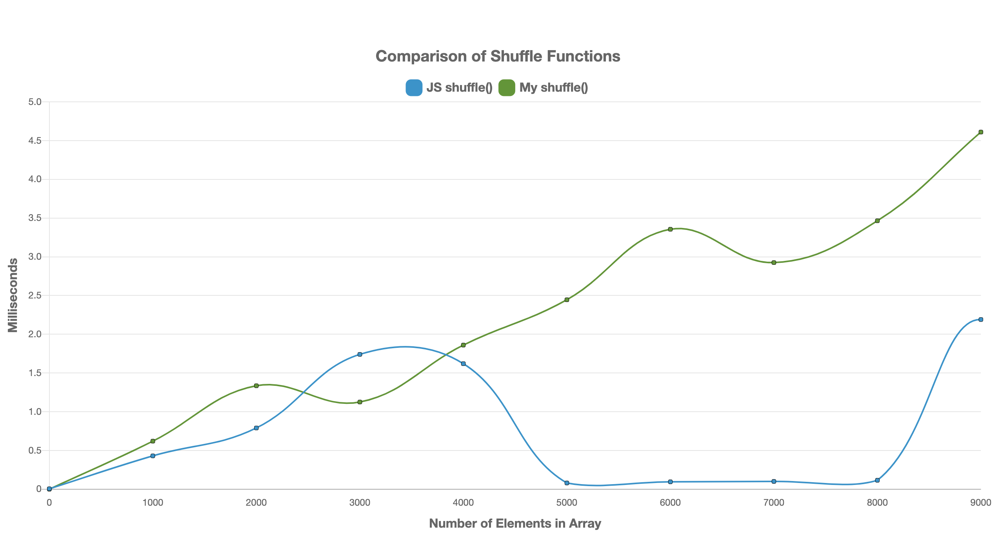
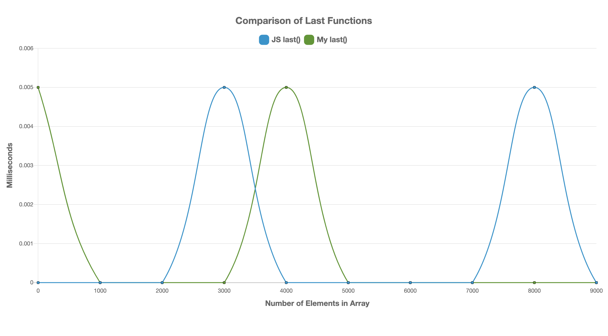

# Algorithmic Complexity

How programs interact with memory, and how to use that to make programmes faster. A series of common algorithms, and the speed difference between different methods. All agorithms are tested in the Benchmarking `run` methods in `timing.js`. I then used `Chart.js` to display the differences between versions of the algorithms. You can substitute the algorithms in for your own, I have left mine at the bottom of each class, and they are plotted on each graph.

For more information regarding Algorithms, Data Structures, and concepts like Big O notation, visit this [repo](https://github.com/davidpaps/algorithms_and_data_structures) to find out more.

---

### How To Run / Tests

To run my examples, clone this repo, and from the command line navigate to the [_Jasmine_](jasmine-3.5.0) directory.

To run the Jasmine test suite, right click on the `SpecRunner.html` file and select `Copy Path`. Paste this into the Google Chrome Web Browser. The test suite will run displaying the 29 passing tests with 100% test coverage.

---

To start, let's look at how fast some standard library functions run. Here are four different ones you can look at:

```
Last => Gets the last element of an array
Reverse => Reverses the elements in an array
Shuffle => Shuffles the elements if an array
Sort => Sorts the elements in an array (ascending by default)
```

**As I have generated arrays from a range, I have first shuffled the arrays before timing as to not bias the results.**

### The Challenge:

- I created a benchmarking function in `timing.js` that will time each execution of a function.
- This will time it at each 'step' of the input size (both can be defined)
- Each 'step' of each algorithm can be rendered on a graph (in `index.js`)

**To see the results from my code:**

Right click on the `Index.html` file and select `Copy Path`. Paste this into the Google Chrome Web Browser. This will display a graph titled `Comparison of Algorithmic Complexity` showing the 4 functions detailed above. The legend's can be clicked to add or remove a function from the graph:


---

### The Challenges:

For each of the following algorithms you write, you should:

- Write tests to make sure the functions work and return the data type you are expecting
- Implement them
- Run your timing framework
- Plot their curves

Here is a list of algorithms for you to implement:

#### Shuffle

- Implement your own algorithm for shuffling the elements in an array (you cannot use `.shuffle`).

#### Reverse

- Implement your own algorithm for reversing elements in an array (you cannot use `.reverse`).

#### Find Duplicates

- Implement your own algorithm to remove all elements that appear more than once in an array (you cannot use `.unique`).

#### Last

- Implement your own algorithm for returning the last element of an array (you cannot use `.last`).

#### Sort (0's and 1's)

- Implement your own algorithm for sorting an array of 0's and 1's (you cannot use `.sort`).

#### Sort

- Implement your own algorithms (`Quick`, `Selection`, `Merge` and `Insertion` sort) for sorting an array in ascending order (you cannot use `.sort`).

#### Most Frequent Words

- Given a list of words, find which words are repeated.

#### Fibonacci

- Create a function that takes a number N and returns an array of the first N numbers in the Fibonacci sequence.

**To see the results from my code:**

Right click on the `Index.html` file and select `Copy Path`. Paste this into the Google Chrome Web Browser. This will display a graph for each of the functions detailed above (each will have a title relating to one of the above algorithms). The legend's can be clicked to add or remove a function from the graph:

<table>
  <tr>
     <td>shuffle()</td>
      <td>reverse()</td>
  </tr>
  <tr>
    <td valign="top"></td>
    <td valign="top"></td>
  </tr>
 </table>

 <table>
  <tr>
     <td>duplicate()</td>
      <td>last()</td>
  </tr>
  <tr>
    <td valign="top"></td>
    <td valign="top"></td>
  </tr>
 </table>

 <table>
  <tr>
     <td>sortZeroOnes()</td>
      <td>sort()</td>
  </tr>
  <tr>
    <td valign="top"></td>
    <td valign="top"></td>
  </tr>
 </table>

 <table>
  <tr>
     <td>frequentWords()</td>
      <td>fibonacci()</td>
  </tr>
  <tr>
    <td valign="top"></td>
    <td valign="top"></td>
  </tr>
 </table>
 
---
