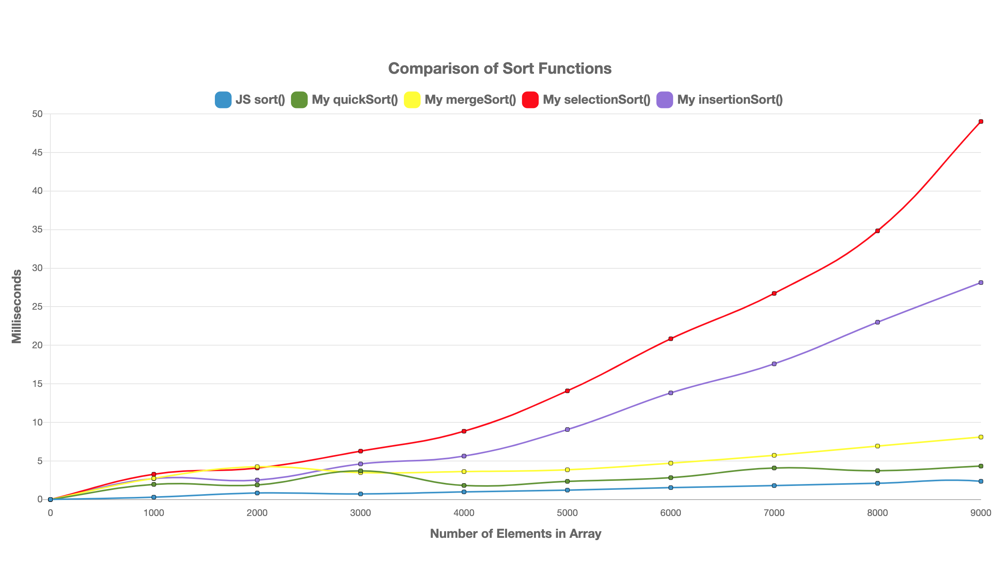

# Algorithmic Complexity

Makers Wokshop - How programs interact with memory, and how to use that to make programmes faster. My workings are writtin in Javascript, but this can be completed in any language.

---

### How To Run / Tests

To run my examples, clone this repo, and from the command line navigate to the [_Jasmine_](jasmine-3.5.0) directory.

To run the Jasmine test suite, right click on the `SpecRunner.html` file and select `Copy Path`. Paste this into the Google Chrome Web Browser. The test suite will run displaying the passing tests.

---

## Chapter 1 Timing Code

To start, let's look at how fast some standard library functions run. Here are four different ones you could be looking at:

Last (get the last element of an array)
Reverse (reverse the elements of an array)
Shuffle (shuffle the elements of an array)
Sort(sort the elements in an array)

(if you are generating an array from a range, don't forget to shuffle it first to not bias the results)

### The Challenges:

- Create some code that returns the time needed to execute a function.
- What if you make the array passed into the functions 10, 100, 1000, 10000 times bigger?
- In order to get further, you'll need to create graphs to compare different pieces of code. You will transform your code into a timing framework. It should:

  - Create arrays of different sizes (try 5000 to 100000 in steps of 5000)
  - Run the code to time on each
  - Print the size and corresponding time.
  - From there, you should use a spreadsheet utility to plot the results into a curve (time spent over input size).

**To see the results from my code:**

Right click on the `Index.html` file and select `Copy Path`. Paste this into the Google Chrome Web Browser. This will display a graph titled `Comparison of Algorithmic Complexity` showing the 4 functions detailed above. The legend's can be clicked to add or remove a function from the graph:

---

# Chapter 2: Building Your Own Algorithms

Now, let's look at efficiency for our own algorithms.

### The Challenges:

For each algorithm you write, you should:

- Write a few tests (covering different cases)
- Implement them
- Run your timing framework
- Plot their curves

Here is a list of algorithms for you to implement:

#### Shuffle

Implement your own algorithm for shuffling (you cannot use `.shuffle`).

#### Reverse

Implement your own algorithm for reversing an array (you cannot use `.reverse`).

#### Find Duplicates

Implement your own algorithm for all elements that appear more than once in an array (you cannot use `.unique`).

#### Last

Implement your own algorithm for returning the last element of an aray (you cannot use `.last`).

#### Sort (0's and 1's)

Implement your own algorithm for sorting an array of 0's and 1's (you cannot use `.sort`).

#### Sort

Implement your own algorithm for sorting an array (you cannot use `.sort`).

**To see the results from my code:**

Right click on the `Index.html` file and select `Copy Path`. Paste this into the Google Chrome Web Browser. This will display a graph for each of the functions detailed above. The legend's can be clicked to add or remove a function from the graph:

<table>
  <tr>
     <td>shuffle()</td>
      <td>reverse()</td>
  </tr>
  <tr>
    <td valign="top"></td>
    <td valign="top"></td>
  </tr>
 </table>

 <table>
  <tr>
     <td>duplicate()</td>
      <td>last()</td>
  </tr>
  <tr>
    <td valign="top"></td>
    <td valign="top"></td>
  </tr>
 </table>

 <table>
  <tr>
     <td>sortZeroOnes()</td>
      <td>sort()</td>
  </tr>
  <tr>
    <td valign="top"></td>
    <td valign="top"></td>
  </tr>
 </table>
 
---
